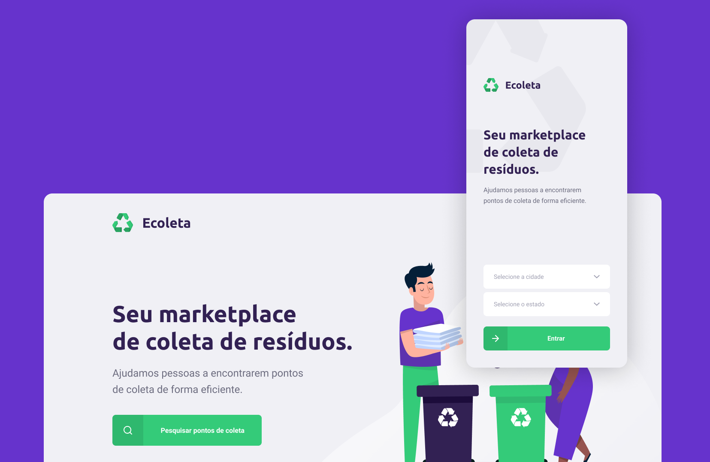

<h1 align="center">
    
</h1>

<h3 align="center">
  Aplicação para coleta de resíduos desenvolvida no evento Next Level Week #01 provida pela <a href="https://rocketseat.com.br/">Rocketseat</a>
</h3>

---

## Sobre o projeto

Este projeto foi desenvolvido no período de uma semana durante o evento *Next Level Week 01*. Neste evento usamos uma única linguagem de programação para desenvolve o backend, frontend e o mobile do projeto.

Usando TypeScript demos superpoderes ao nosso projeto; usando expo aceleramos o desenvolvimento do mobile a mil por hora; colocando tudo em um monorepo com yarn a organização subiu de nível. Se você quiser usar monorepo em projetos com expo, consulte esse [link](https://github.com/expo/expo/tree/master/packages/expo-yarn-workspaces)

Ecoleta é um sistema que permite conectar pessoas que possuem resíduos a serem descartados à estabelecimentos que os recolhem. Como você deve saber, não são todos os resíduos que podemos descartar no lixo comum, muitos deles devem ser levados a pontos específicos de coleta para que assim preservemos o meio ambiente.

Por meio do aplicativo web Ecoleta, empresas podem se registrar e informar onde ela está localizada assim como quais tipos de resíduos esta coleta, e por meio do aplicativo mobile usuários podem localizar num mapa os pontos de coleta próximos a sua localização, assim como filtrar pelos resíduos que desejam descartar para exibir no mapa apenas os pontos que coletam os resíduos que o usuário tem interesse. Caso queira, o usuário pode ainda entrar em contato por Whatsapp ou E-mail por meio do próprio aplicativo.

    

## Get Started

Para executar o projeto Ecoleta você deve possuir o node e o yarn instalados na sua máquina, após ter ambas as ferramentas instaladas siga os passos abaixo:

Clone do repositório para o seu workspace 
Abra o terminal no diretório do projeto e execute `yarn install` para baixar as dependências

### Executando o Backend
  - Acesse o diretório backend e execute `yarn knex migrate:latest` para criar a base de dados
  - Depois execute o comando `yarn knex seed:run` para inserir os registros iniciais
  - Por fim execute `yarn dev` e a aplicação será iniciada

### Executando o Frontend
  - Abra o diretório frontend no terminal e execute o comando `yarn start`

### Executando o mobile
  - Abra o diretório mobile e execute `yarn start`
  - Na tela do browser que for apresentada, copie o endereço ip (sem a porta) apresentado no canto inferior esquerdo da tela
  - Abra o arquivo [api.ts](./mobile/src/services/api.ts) em __mobile/src/services/__
  - Edite o endereço ip do parâmetro `baseURL` copiado anteriormente
  - Abra o arquivo [.env](./backend/.env) em __backend/__
  - Altere o nome _localhost_ pelo endereço ip copiado
  - No terminal usado para inicializar o mobile pressione Ctrl+C para interromper o servidor
  - Execute novamente `yarn start`
  - Baixe o aplicativo Expo no seu smartphone
  - Use o leitor de código de barras do aplicativo para ler o código apresentado no browser (o seu computador e o seu smartphone precisam estar na mesma rede)

### Testando as rotas

O backend desta aplicação é uma API REST, as rotas existentes foram testadas durante o seu desenvolvimento com o aplicativo Insomnia, você pode baixar o json de teste clicando no botão abaixo.

## Licença

Esse projeto está sob a licença MIT. Veja o arquivo [LICENSE](LICENSE) para mais detalhes.

---

by Mauricio Redmerski André
